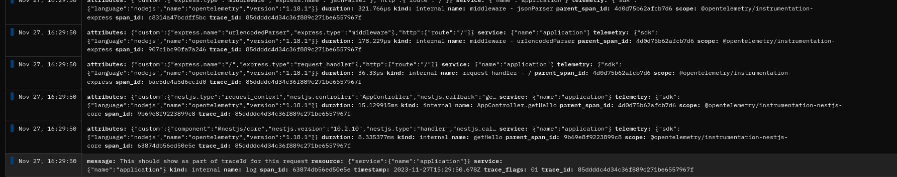
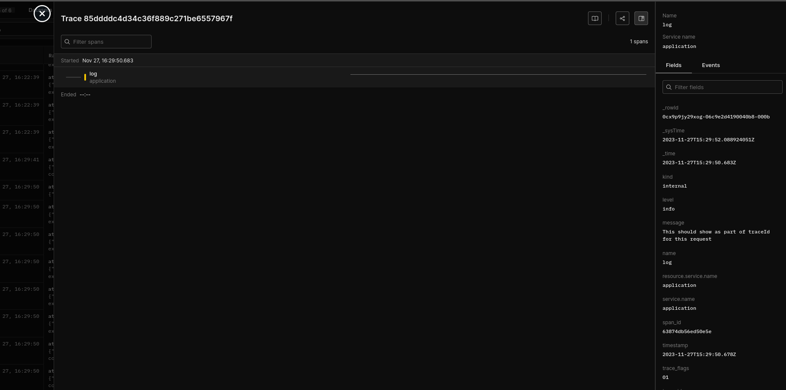

### Reproduction case for issue with Axiom.co handling logs with trace_id

To run this repo, please create .env file and fill it with values. You can take reference from .env.example on what's needed.

Then you can run `nest run` and open `http://localhost:3000/` to call `GET /`

The issue here is that the moment we log with Axiom-Winston Transport to the same dataset that we use for OpenTelemetry, it will break Trace Details View if logs have `trace_id` and/or `span_id` fields.
After calling GET `/`, Axiom will receive one log line and multiple Open Telemetry Spans:

When trying to open a trace, Trace Details view won't show anything:

If we stop logging with Axiom and instead wrap log into a Span or an Event, it will show up in the Waterfall.